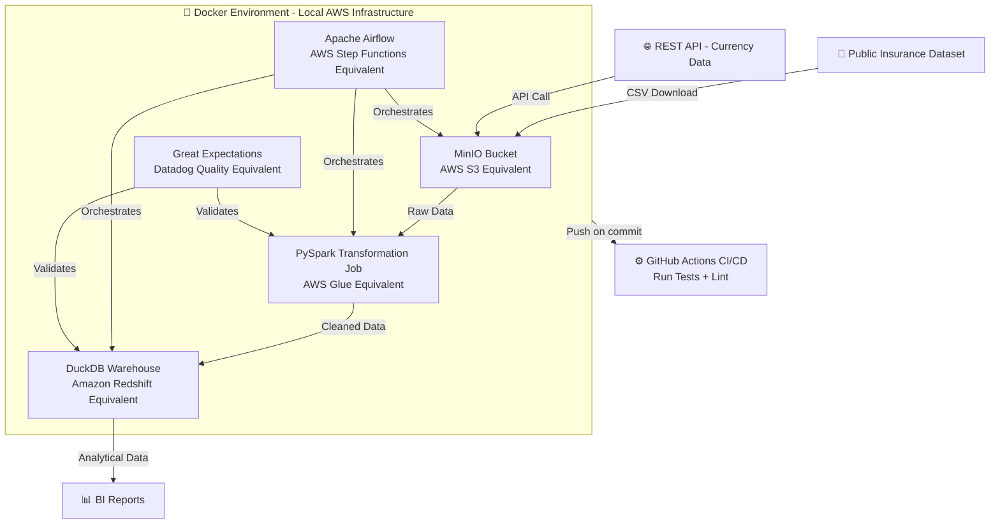

# 🏗️ Insurance Data Pipeline

An end-to-end cloud data engineering pipeline that ingests,
transforms, and loads US insurance data into an analytical
warehouse for business intelligence reporting.

Built to demonstrate production-grade data engineering practices
using AWS-equivalent local infrastructure — every component maps
directly to a real AWS service.

---

## 📐 Architecture



---

## 🗂️ Project Structure

```
insurance-data-pipeline/
├── .github/
│   └── workflows/
│       └── ci.yml
├── dags/
│   └── insurance_pipeline_dag.py
├── jobs/
│   ├── ingestion/
│   │   └── ingest_raw_data.py
│   ├── transformation/
│   │   └── transform_claims.py
│   └── loading/
│       └── load_to_warehouse.py
├── infra/
│   └── docker-compose.yml
├── data/
│   ├── raw/
│   └── processed/
├── tests/
│   ├── test_ingestion.py
│   ├── test_transformation.py
│   └── test_loading.py
├── config/
│   └── pipeline_config.yml
├── docs/
├── notebooks/
├── .env.example
├── requirements.txt
└── README.md
```

---

## 🛠️ Tech Stack

| Component | Local Tool | AWS Equivalent |
|---|---|---|
| File Storage | MinIO | Amazon S3 |
| Data Transformation | PySpark | AWS Glue + PySpark |
| Data Warehouse | DuckDB | Amazon Redshift / Snowflake |
| Orchestration | Apache Airflow | AWS Step Functions / MWAA |
| Data Quality | Great Expectations | Datadog Reconciliation |
| Infrastructure | Docker Compose | AWS CDK |
| CI/CD | GitHub Actions | GitHub Actions |
| Secret Management | .env | AWS Secrets Manager / Cloudforge |

---

## 📊 Dataset

This pipeline processes the
[publicly available US Insurance Dataset](https://www.kaggle.com/datasets/teertha/ushealthinsurancedataset)
containing insurance claims, premiums, and policyholder data.

**Pipeline stages:**
- **Ingestion** — Download raw CSV → land in MinIO (S3 equivalent)
- **Transformation** — PySpark job cleans, validates, and enriches data
- **Loading** — Curated data loaded into DuckDB analytical warehouse
- **Quality** — Great Expectations validates data at each layer
- **Orchestration** — Airflow DAG schedules and monitors the full flow

---

## 🚀 Getting Started

### Prerequisites
- Docker Desktop
- Python 3.13+
- Git

### 1. Clone the repository

```bash
git clone https://github.com/Gokul-Prasath-NAS/insurance-data-pipeline.git
cd insurance-data-pipeline
```

### 2. Set up environment variables

```bash
cp .env.example .env
# Edit .env with your local configuration
```

### 3. Install Python dependencies

```bash
pip install -r requirements.txt
```

### 4. Start the infrastructure

```bash
docker-compose -f infra/docker-compose.yml up -d
```

### 5. Run the pipeline

```bash
# Access Airflow UI at http://localhost:8080
# Trigger the insurance_pipeline_dag
```

---

## 📁 Pipeline Flow

```
RAW DATA          TRANSFORM            WAREHOUSE
--------          ---------            ---------
CSV Files    -->  PySpark Job    -->   DuckDB Tables
MinIO Bucket      Cleaned Data         dim_policies
(S3 raw/)         Enriched Data        dim_customers
                                       fact_claims
                                       fact_premiums
```

---

## ✅ Data Quality Checks

Great Expectations validates:
- No null values in critical columns (policy_id, claim_amount)
- claim_amount within expected range (> 0)
- Date formats consistent across records
- No duplicate policy records
- Premium to claim ratio within expected bounds

---

## 🔄 CI/CD Pipeline

GitHub Actions workflow automatically:
1. Runs unit tests on every push
2. Validates PySpark transformation logic
3. Checks data quality expectations
4. Lints Python code with flake8

---

## 👤 Author

**Gokul Prasath NAS**
Data Engineer | AWS · PySpark · Snowflake · Redshift

[](https://www.linkedin.com/in/gokul-prasath-nas)
[](https://github.com/Gokul-Prasath-NAS)

